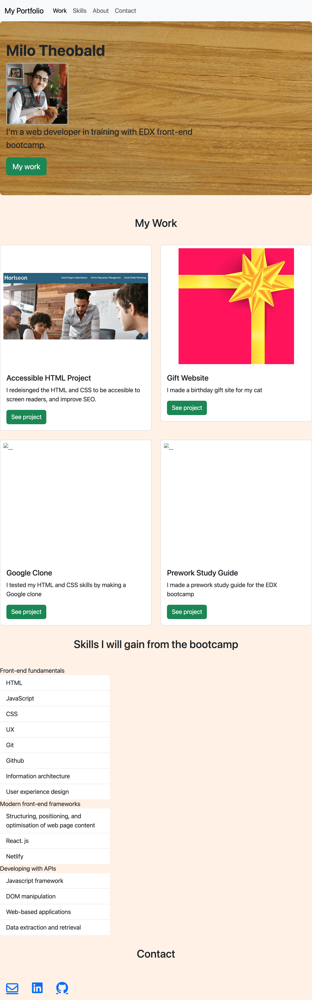

# bootstrap-portfolio

git repo: https://github.com/liquidgarbage/bootstrap-portfolio

page address: https://liquidgarbage.github.io/bootstrap-portfolio/

- [Description](#description)
- [Usage](#usage)
- [Credits](#credits)
- [License](#license)
- [Issues to resolve](#issues-to-resolve)

## Description

This page is a portfolio of my web development work, using bootstrap.  
It is an on-going project. As I learn more the site will have more content.

I built it to provide a portfolio of my work to potential employers.
I also built it for myself. I am proud of the things I have made so far. I am excited to see things become more complex as I learn more.

I solved problems such as:

- figuring out equal cell size grid elements

I learnt:

- how to use bootstrap to design a page
- how to change colour elements of bootstrap such as buttons
- how to customise bootstrap with my own CSS

## Installation

N/A

## Usage

To be used as a portfolio to show work to others

Desktop View

Mobile View

OG Portfolio

## Credits

[Bootstrap elements](https://getbootstrap.com/docs/5.3/getting-started/introduction/)

[font awesome icons](https://cdnjs.com/libraries/font-awesome)

## Licence

Please refer to the LICENSE in the repo.

## Issues to resolve

The site is still unfinished. Learning Javascript has taken over my time.
What needs fixing:

- [ ] gitpages not loading some images
- [ ] Alt image descriptions
- [ ] hover effect on hyperlinks in footer
- [ ] finish about me and contact section
- [ ] skills section to grid
- [ ] work grid responsive to smaller screens

You can also see these in the Issues section of the repo:
https://github.com/liquidgarbage/bootstrap-portfolio/issues
